# MANUAL DE USUARIO OFICIAL — MANAGERPRO
## Guía Integral de Operación y Administración de Torneos, Delegaciones y Arbitraje Deportivo

---

> **Versión del Sistema:** v2.4 Enterprise / Cloud  
> **Ámbito:** Plataforma de Gestión Deportiva Integral  
> **Fecha de Actualización:** Agosto 2026  
> **Destinatarios:** Administradores de Torneos, Delegados de Equipos, Árbitros Oficiales y Personal de Mesa  
> **Estado:** Documentación Oficial Aprobada  

---

## ÍNDICE GENERAL

* **1. INTRODUCCIÓN Y ARQUITECTURA DEL SISTEMA**
  * 1.1. Propósito de la Plataforma
  * 1.2. Objetivos Operativos
  * 1.3. Matriz de Roles y Permisos (Administrador, Delegado, Árbitro)

* **2. ACCESO AL SISTEMA Y SEGURIDAD**
  * 2.1. Pantalla de Inicio de Sesión (Login)
  * 2.2. Cambio Obligatorio de Contraseña
  * 2.3. Personalización de Tema (Modo Oscuro / Modo Día)

* **3. MÓDULO DEL ADMINISTRADOR**
  * 3.1. Panel Principal de Torneos (Dashboard)
  * 3.2. Creación y Configuración de Nuevos Torneos (Paso a Paso, Flujos y Formatos)
    * 3.2.1. Diagrama de Flujo del Proceso de Configuración
    * 3.2.2. Formatos de Competencia Disponibles y Lógica de Disputa
    * 3.2.3. Tabla de Parámetros y Reglas de Validación
    * 3.2.4. Ciclo de Vida Operativo de un Torneo
  * 3.3. Asignación y Selección de Equipos al Torneo
  * 3.4. Gestión de Personal (Alta de Árbitros y Asistentes)
  * 3.5. Gestión Global de Equipos y Asignación de Delegados
  * 3.6. Generación Automatizada del Fixture
  * 3.7. Programación de Partidos (Canchas, Horarios y Árbitros)
  * 3.8. Emisión de Comunicados Oficiales
  * 3.9. Control Financiero y Balances por Torneo

* **4. MÓDULO DEL DELEGADO**
  * 4.1. Configuración Inicial del Equipo e Identidad Visual (Escudo / Foto)
  * 4.2. Gestión del Plantel de Jugadores
    * 4.2.1. Alta Individual de Jugadores y Carga de DNI
    * 4.2.2. Reglas de Validación de Edad y Cupo de Excepciones
    * 4.2.3. Modificación de Datos de Jugadores
    * 4.2.4. Baja / Eliminación de Jugadores
    * 4.2.5. Seguimiento del Estado de Aprobación (Pendiente, Aprobado, Rechazado)
  * 4.3. Consulta de la Competencia y Seguimiento Deportivo
    * 4.3.1. Fixture y Calendario de Partidos
    * 4.3.2. Tabla de Posiciones y Estadísticas
    * 4.3.3. Goleadores, Amonestados y Sancionados
  * 4.4. Bandeja de Comunicados Oficiales

* **5. MÓDULO DEL ÁRBITRO**
  * 5.1. Consulta de Partidos Asignados
  * 5.2. Confección y Carga del Informe Arbitral Digital (Acta de Partido)
    * 5.2.1. Carga de Goles (Locales, Visitantes y Autogoles)
    * 5.2.2. Registro de Sanciones Disciplinarias (Amarillas y Rojas con Motivo)
    * 5.2.3. Observaciones del Encuentro e Informe de Incidentes
  * 5.3. Cierre del Acta y Cómputo del Resultado Final

* **6. PREGUNTAS FRECUENTES (FAQ)**

* **7. RESOLUCIÓN DE ERRORES COMUNES Y TROUBLESHOOTING**

* **8. BUENAS PRÁCTICAS Y RECOMENDACIONES OPERATIVAS**

* **9. GLOSARIO DE TÉRMINOS**

---

## 1. INTRODUCCIÓN Y ARQUITECTURA DEL SISTEMA

### 1.1. Propósito de la Plataforma
**MANAGERPRO** es una solución integral en la nube diseñada para digitalizar, optimizar y profesionalizar la administración de ligas, torneos y competencias deportivas de fútbol. La plataforma centraliza en un único entorno coordinado a administradores de ligas, delegados de equipos, cuerpos arbitrales y supervisores deportivos.

### 1.2. Objetivos Operativos

* **Eliminación del papel y actas manuales:** Digitalización en tiempo real del fixture, altas de jugadores e informes arbitrales.

* **Trazabilidad y transparencia deportiva:** Validación automática de edades, DNI, suspensiones por acumulación de tarjetas amarillas y expulsiones directas.

* **Comunicación fluida:** Notificaciones instantáneas y circulares oficiales entre administración y delegados.

* **Consistencia estadística:** Actualización instantánea de tablas de posiciones, tablas de goleadores, valla menos vencida y estados de fair play.

### 1.3. Matriz de Roles y Permisos

| Rol | Alcance Operativo | Módulos Accesibles | Responsabilidades Clave |
| :--- | :--- | :--- | :--- |
| **ADMINISTRADOR** | Gestión total de torneos asignados | Torneos, Equipos, Personal, Fixture, Programación, Comunicados, Finanzas | Crear torneos, asignar equipos, generar fixture, programar partidos, crear árbitros, aprobar/rechazar jugadores, emitir comunicados oficiales. |
| **DELEGADO** | Gestión exclusiva de su equipo | Mi Equipo, Jugadores, Competencia (Fixture, Posiciones, Estadísticas), Comunicados | Cargar logo/escudo del equipo, inscribir y gestionar jugadores con fotos de DNI, consultar fechas y tablas, leer circulares. |
| **ÁRBITRO** | Carga de actas de sus partidos | Mis Partidos Asignados, Acta Digital de Partido | Consultar designaciones, registrar goles, tarjetas amarillas/rojas con motivos, asentar observaciones y cerrar resultado final. |

---

## 2. ACCESO AL SISTEMA Y SEGURIDAD

### 2.1. Pantalla de Inicio de Sesión (Login)
Para ingresar al sistema, diríjase a la URL oficial provista por la organización desde cualquier navegador moderno (Google Chrome, Microsoft Edge, Mozilla Firefox o Safari).

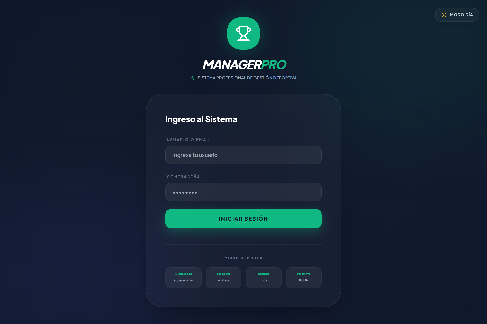

#### Pasos para Iniciar Sesión:
1. Ingrese su **Nombre de Usuario** o **Correo Electrónico** en el primer campo.
2. Ingrese su **Contraseña** de acceso.
3. Presione el botón verde **"INICIAR SESIÓN"**.
4. Si las credenciales son válidas, el sistema lo redireccionará automáticamente a la interfaz correspondiente a su rol asignado.

### 2.2. Cambio Obligatorio de Contraseña
Por políticas de ciberseguridad, todo usuario nuevo creado por la administración (delegados o árbitros) con contraseña provisoria deberá cambiar su clave en el primer inicio de sesión antes de acceder a los módulos operativos.

### 2.3. Personalización de Tema (Modo Oscuro / Modo Día)
La plataforma cuenta con un conmutador de tema visual en el encabezado superior y en la barra lateral. Puede alternar en cualquier momento entre **Modo Oscuro (Dark Theme)** y **Modo Día (Light Theme)** según sus preferencias lumínicas y el dispositivo utilizado.

---

## 3. MÓDULO DEL ADMINISTRADOR

El **Administrador** es el perfil operativo principal responsable de coordinar la competencia de punta a punta.


---

### 3.1. Panel Principal de Torneos (Dashboard)
Al ingresar como Administrador, el sistema presenta el panel general con las siguientes secciones:

* **Indicadores Superiores:** Total de torneos activos, límite de torneos contratados y estado general de la cuenta.

* **Grilla de Torneos Activos:** Tarjetas de torneos con detalles rápidos: cantidad de equipos inscriptos, formato, modalidad de disputa, límite de edad y cupo máximo de jugadores.

* **Accesos Directos por Torneo:** Botón **Fixture**, botón **Estadísticas** y botón **Finanzas**.

* **Balance Financiero General:** Resumen consolidado de ingresos, egresos y resultado neto del período.

---

### 3.2. Creación y Configuración de Nuevos Torneos (Paso a Paso)

La creación de un torneo es la operación fundacional de la que derivan el fixture, las reglas de elegibilidad de los planteles y el cómputo de posiciones. Al presionar el botón **"+ NUEVO TORNEO"**, el sistema despliega el modal interactivo de alta y configuración:

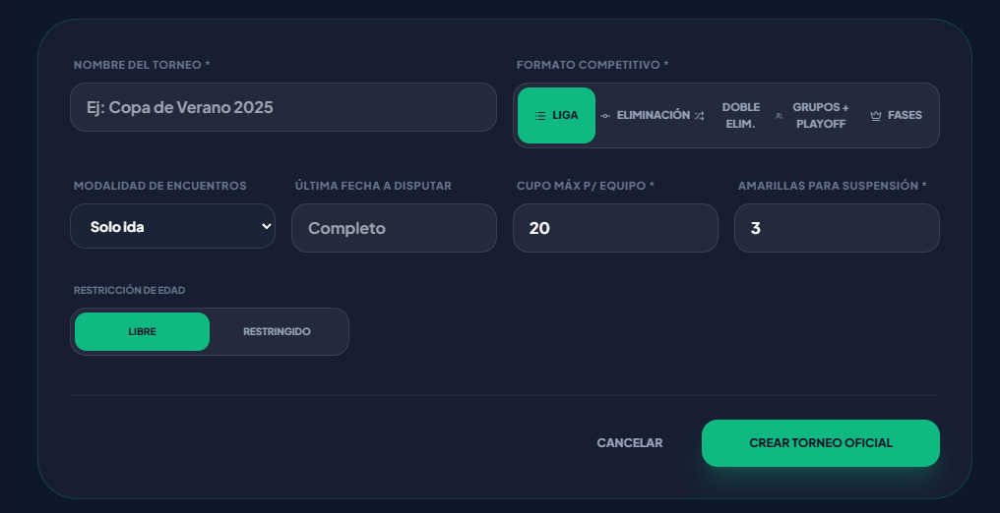

#### 3.2.1. Diagrama de Flujo del Proceso de Configuración

```
   ┌─────────────────────────────────────────────────────────────┐
   │             PASO 1: IDENTIFICACIÓN Y CATEGORÍA               │
   │  • Nombre oficial del torneo  • Tipo: Masculino/Femenino/Mix │
   └──────────────────────────────┬──────────────────────────────┘
                                  │
                                  ▼
   ┌─────────────────────────────────────────────────────────────┐
   │             PASO 2: FORMATO DE COMPETENCIA                  │
   │  • Liga (Ida / Vuelta)        • Eliminación Directa         │
   │  • Doble Eliminación          • Grupos + Playoffs / Zonas   │
   └──────────────────────────────┬──────────────────────────────┘
                                  │
                                  ▼
   ┌─────────────────────────────────────────────────────────────┐
   │             PASO 3: REGLAS DE EDAD Y CUPOS                  │
   │  • Edad Libre o Restringida (+35, +40, etc.)                │
   │  • Cupo de Excepciones de Edad • Máximo de Fichas p/ Equipo │
   └──────────────────────────────┬──────────────────────────────┘
                                  │
                                  ▼
   ┌─────────────────────────────────────────────────────────────┐
   │             PASO 4: PARÁMETROS DISCIPLINARIOS               │
   │  • Límite de Tarjetas Amarillas para Suspensión Automática  │
   └──────────────────────────────┬──────────────────────────────┘
                                  │
                                  ▼
   ┌─────────────────────────────────────────────────────────────┐
   │             PASO 5: ALTA Y ASIGNACIÓN DE EQUIPOS            │
   │  • Selección de Clubes • Generación del Fixture Automatizado │
   └─────────────────────────────────────────────────────────────┘
```

#### 3.2.2. Formatos de Competencia Disponibles y Lógica de Disputa

El motor de MANAGERPRO soporta 5 modalidades estructurales de competición:

| Formato | Estructura y Funcionamiento | Modalidades y Criterios | Ideal para |
| :--- | :--- | :--- | :--- |
| **Liga Regular (Todos contra Todos)** | Sistema de todos contra todos por puntos clásico. Todos los equipos se enfrentan entre sí a lo largo de fechas consecutivas. | • **Ronda Simple (Ida):** 1 partido por rival.<br>• **Ronda Doble (Ida y Vuelta):** Local y visitante. | Torneos largos, ligas anuales o torneos apertura/clausura. |
| **Eliminación Directa (Playoffs)** | Cuadro de llaves eliminatorias por parejas (Octavos, Cuartos, Semifinal y Final). El perdedor queda eliminado. | • Cruce a partido único.<br>• Definición por penales o tiempo extra en caso de empate. | Copas de eliminación rápida o fases finales de campeonatos. |
| **Doble Eliminación** | Sistema de cuadro superior (Ganadores) y cuadro inferior (Perdedores). Un equipo debe perder 2 veces para quedar eliminado. | • **Final Única:** Un solo partido por el título.<br>• **Final con Reset:** Si gana el cuadro de perdedores, se juega un segundo desempate. | Torneos competitivos de alta paridad donde se premia la regularidad. |
| **Grupos + Playoffs** | **Fase 1:** División de equipos en grupos (zonas).<br>**Fase 2:** Los mejores de cada grupo clasifican a una llave de playoffs por el título. | • Cantidad configurable de grupos (2, 4, 8).<br>• Cantidad de clasificados por grupo (ej. 1º y 2º).<br>• Cruces cruzados (1ºA vs 2ºB). | Torneos masivos con muchos equipos que requieren reducir fechas. |
| **Grupos + Zonas + Playoffs (Copa Oro / Plata)** | **Fase 1:** Grupos clasificatorios.<br>**Fase 2:** Reagrupamiento en Zonas (Zona Oro para los 1º/2º, Zona Plata para 3º/4º).<br>**Fase 3:** Playoffs finales independientes por cada Copa. | • Arrastre de puntos opcional.<br>• Múltiples campeones por nivel de competencia. | Ligas que buscan mantener a todos los equipos compitiendo hasta la última fecha. |

#### 3.2.3. Tabla Exhaustiva de Parámetros de Configuración

| Parámetro | Requerido | Tipo de Dato | Opciones / Rango | Descripción e Impacto en el Sistema |
| :--- | :---: | :---: | :---: | :--- |
| **Nombre del Torneo** | Sí | Texto | 3 - 60 caracteres | Nombre público oficial que figurará en encabezados, diplomas y tablas de posiciones. |
| **Categoría / Tipo** | Sí | Selector | Masculino / Femenino / Mixto | Clasificación de género para segmentación de estadísticas y planteles. |
| **Formato** | Sí | Selector | Liga, Eliminación, Doble Eliminación, Grupos+Playoffs, Grupos+Zonas | Define la estructura de llaves, cantidad de fechas y motor de generación de fixture. |
| **Modalidad de Liga** | Condicional | Selector | IDA / IDA_VUELTA | Aplica para formato Liga. Define si se juega a una sola rueda o ida y vuelta. |
| **Regla de Edad** | Sí | Selector | Libre / Restringido | Si se elige restringido, se habilita el campo de edad mínima requerida (+35, +40, etc.). |
| **Límite de Edad** | Condicional | Numérico | 15 - 70 años | Umbral mínimo de edad requerido. El sistema calculará la edad del jugador según su DNI. |
| **Cupo de Excepciones** | Condicional | Numérico | 0 - 10 jugadores | Cantidad máxima de jugadores menores al límite que un equipo puede inscribir. |
| **Máximo de Jugadores** | Sí | Numérico | 10 - 40 jugadores | Cupo máximo de futbolistas habilitados en la lista de buena fe de cada equipo. |
| **Tarjetas para Suspensión** | Sí | Numérico | 1 - 10 amarillas | Cantidad de tarjetas amarillas acumuladas que disparan automáticamente 1 fecha de sanción. |

#### 3.2.4. Ciclo de Vida Operativo de un Torneo

1. **Fase de Configuración:** Creación del torneo, definición de cupos y bases reglamentarias.
2. **Fase de Inscripción y Validación:** Asignación de equipos, vinculación de delegados y aprobación de fichas de jugadores.
3. **Fase de Fixture:** Generación algorítmica de los cruces y publicación del cronograma.
4. **Fase de Disputa:** Programación semanal de canchas, designación de árbitros y carga de actas digitales fecha tras fecha.
5. **Fase de Cierre y Coronación:** Cómputo final de tablas, consagración del campeón y archivo histórico.

---

### 3.3. Asignación y Selección de Equipos al Torneo
Una vez creado el torneo, es necesario asignarle los equipos participantes:

1. Ir a la sección **Equipos**.
2. Seleccionar equipos desde **"Equipos sin asignar"** o de algún otro torneo si se desea cambiar el equipo de torneo.
3. Una vez que tengamos el equipo, en el selector de **Torneo** seleccionamos el torneo que creamos.

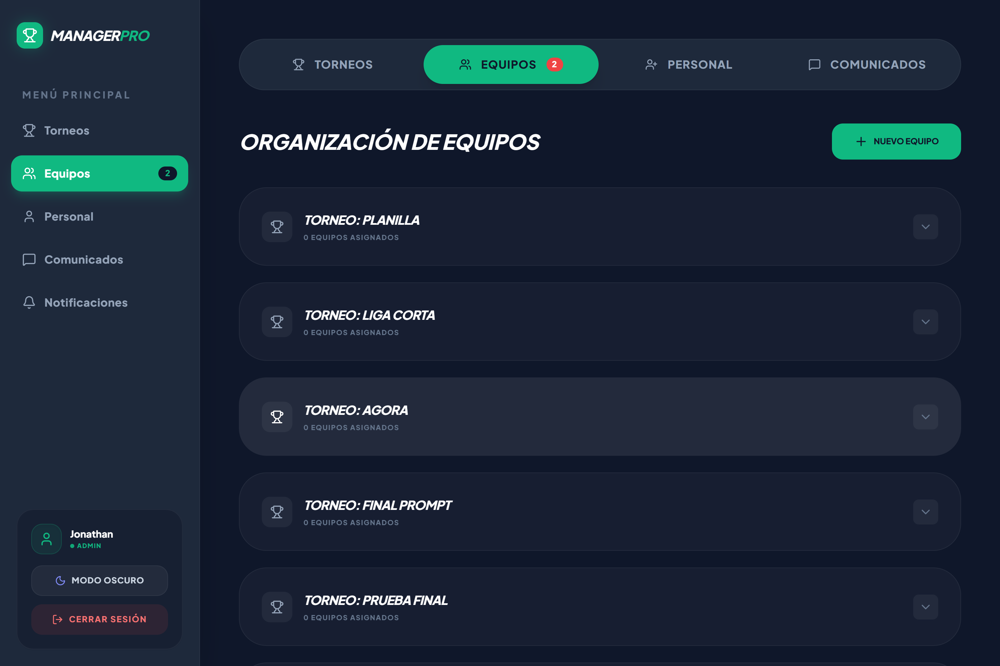

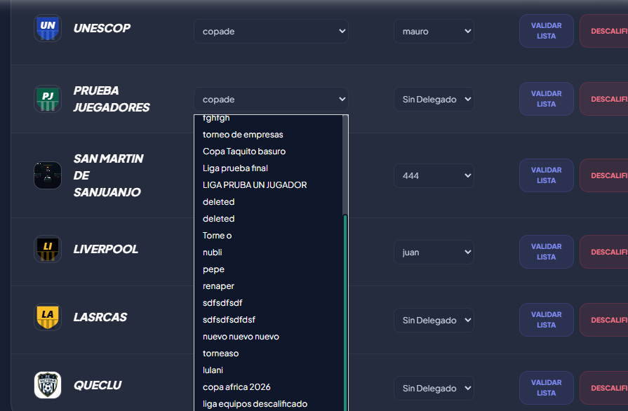

> [!IMPORTANT]
> Para generar el fixture de cualquier torneo se requiere un **mínimo de 4 equipos** asignados. Si el torneo tiene formato de grupos, asigne los equipos equitativamente a cada zona.

---

### 3.4. Gestión de Personal (Alta de Árbitros y Asistentes)
El módulo de personal permite registrar y administrar a las autoridades arbitrales que dirigirán los encuentros.

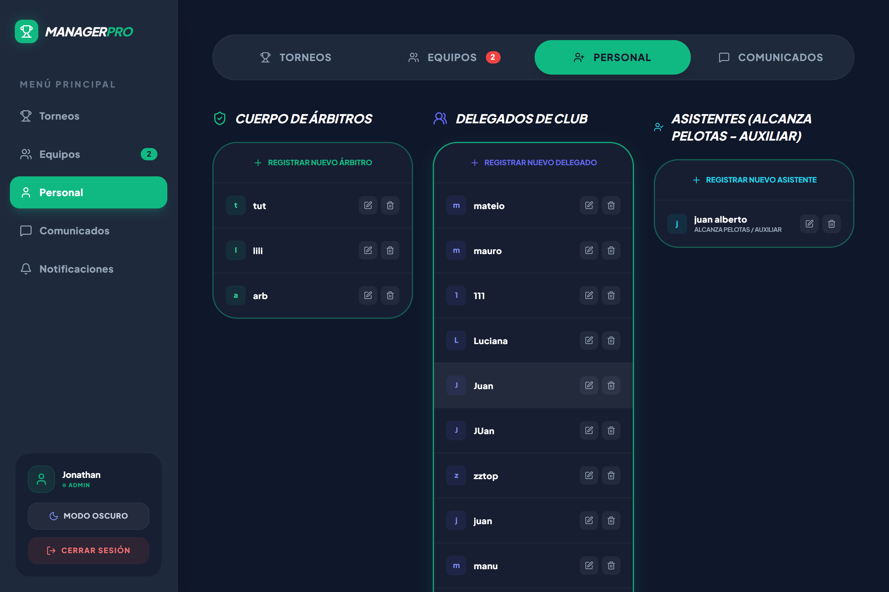

#### Pasos para Crear un Árbitro o Asistente:

1. En la barra lateral izquierda, seleccione la pestaña **"Personal"**.

2. Haga clic en el botón **"+ NUEVO PERSONAL"**.

3. En el modal emergente, configure los datos del usuario:
   * **Rol:** Seleccione entre `ÁRBITRO` (habilitado para cargar actas) o `ASISTENTE` (personal de mesa / veedor).
   * **Nombre Completo:** Nombre y Apellido del colegiado.
   * **Correo Electrónico:** Email oficial de contacto.
   * **Nombre de Usuario:** Identificador único para el inicio de sesión (ej. `arb_gonzalez`).
   * **Contraseña:** Clave de acceso inicial.

4. Presione **"GUARDAR PERSONAL"**.

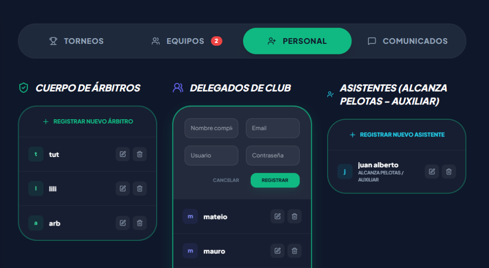

> [!NOTE]
> El personal creado quedará inmediatamente disponible en el selector de asignación de partidos dentro de la programación de fechas.

---

### 3.5. Gestión Global de Equipos y Asignación de Delegados
En la pestaña **"Equipos"** de la barra lateral, el Administrador tiene la visión panorámica de todos los clubes y planteles registrados.


#### Funciones Principales del Módulo de Equipos:

* **Crear Nuevo Equipo:** Permite dar de alta una institución deportiva definiendo su nombre y asignándolo a un torneo.

* **Asignar Delegado:** Cada equipo debe contar con un Delegado responsable. Haga clic en el botón **"Asignar Delegado"** o **"Editar"** en la tarjeta del equipo para vincular un usuario existente o generar uno nuevo con usuario y contraseña.

* **Auditoría de Jugadores:** El badge numérico rojo en el menú indica cuántos jugadores están pendientes de aprobación por parte del Administrador.

* **Aprobación / Rechazo de Fichas:** El Administrador puede abrir el plantel, verificar la foto del DNI y aprobar o rechazar con motivo fundado.

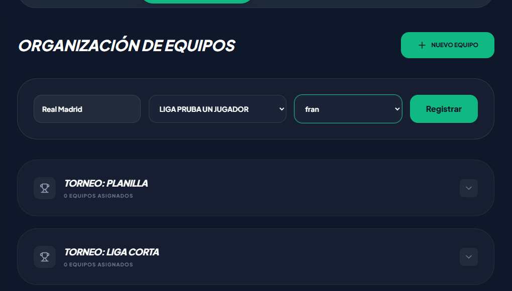

---

### 3.6. Generación Automatizada del Fixture
La plataforma cuenta con un motor algorítmico de generación de fixtures (sistema de todos contra todos y llaves de eliminación directa balanceadas).

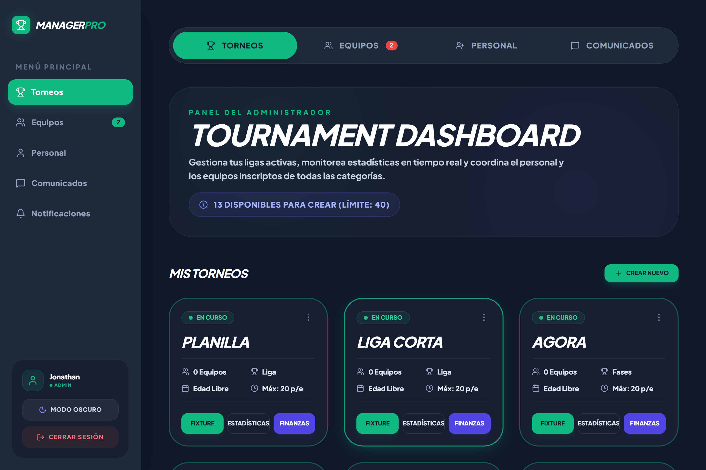

#### Pasos para Generar el Fixture:

1. Ingrese a la vista de gestión del torneo y seleccione la subpestaña **"Fixture / Partidos"**.

2. Si el fixture no ha sido generado aún, presione el botón verde **"GENERAR FIXTURE"**.

3. El sistema creará automáticamente todas las fechas (Fecha 1, Fecha 2, ..., Fecha N) o fases de eliminación (Octavos, Cuartos, Semifinal, Final), emparejando a los equipos locales y visitantes de manera alternada y equitativa.

4. Si un equipo queda libre por número impar de participantes, el sistema lo marcará explícitamente como "Libre".

---

### 3.7. Programación de Partidos (Canchas, Horarios y Árbitros)
Una vez generado el fixture, los partidos quedan en estado inicial sin horario ni sede. El Administrador debe programar cada cotejo:

1. En la lista de partidos de la fecha deseada, localice el encuentro y haga clic en el botón con ícono de **Calendario / "Programar"**.

2. Se abrirá el modal de **Programación de Partido**:

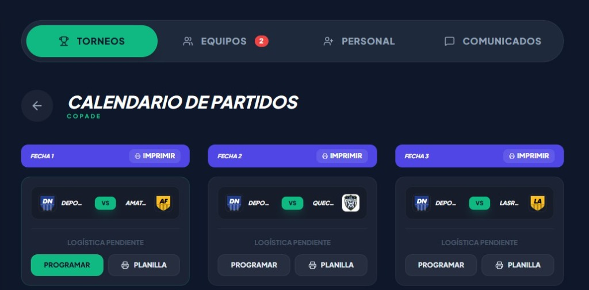

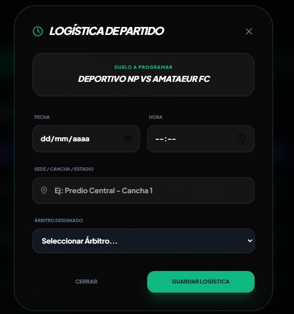

3. Configure los datos logísticos:
   * **Fecha del Partido:** Selección del día de juego en el calendario (ej. `2026-08-22`).
   * **Horario:** Hora de inicio del partido (ej. `19:30`).
   * **Cancha / Predio:** Selección o escritura de la cancha asignada (ej. *Cancha 1 - Sintético* o *Predio Central*).
   * **Árbitro Designado:** Desplegable con los árbitros registrados en el módulo de Personal.

4. Haga clic en **"GUARDAR PROGRAMACIÓN"**.

5. El partido pasará a estado `PROGRAMADO` y se notificará automáticamente tanto a los delegados de ambos equipos como al árbitro designado.

---

### 3.8. Emisión de Comunicados Oficiales
El módulo **"Comunicados"** permite enviar resoluciones disciplinarias, modificaciones de horarios o boletines informativos.

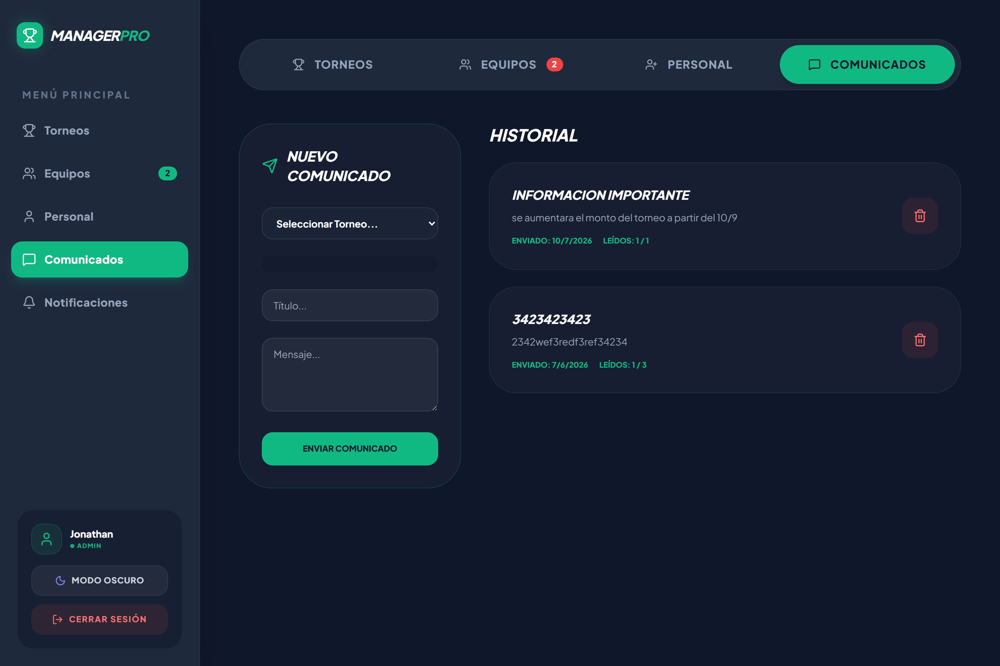

* Seleccione el torneo correspondiente.

* Elija si el comunicado va dirigido a **Todos los Delegados** o a **Delegados Específicos**.

* Ingrese el Título y el Cuerpo del mensaje.

* Adjunte opcionalmente un archivo (PDF, reglamento o imagen).

* Presione **"ENVIAR COMUNICADO"**.

---

### 3.9. Control Financiero y Balances por Torneo
Dentro de cada torneo, la pestaña **"Finanzas"** permite registrar aranceles de inscripción por equipo, costos de canchas, premios, pago a árbitros y generar reportes financieros con cálculo automático de márgenes y saldos pendientes.

---

## 4. MÓDULO DEL DELEGADO

El **Delegado** es el representante oficial del equipo ante la organización del torneo.

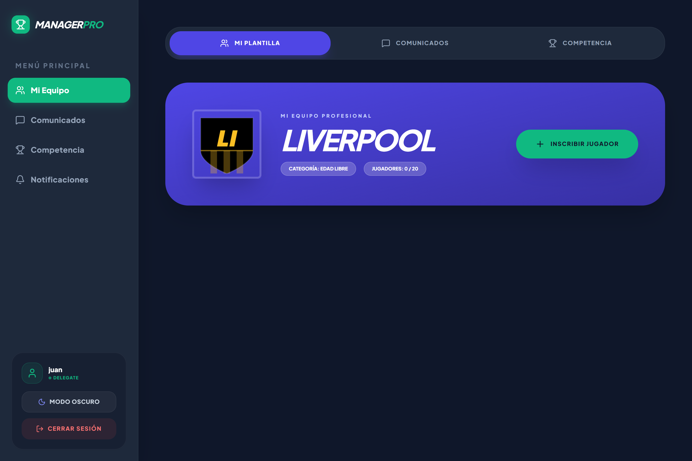

---

### 4.1. Configuración Inicial del Equipo e Identidad Visual (Escudo / Foto)
Al ingresar por primera vez, el delegado debe personalizar la identidad de su escuadra:

1. Diríjase a la pestaña **"Mi Equipo"** en el menú lateral.
2. En la cabecera del equipo, haga clic sobre el recuadro del **Escudo / Foto de Portada** (ícono de cámara fotográfica).
3. Seleccione un archivo de imagen en formato PNG o JPG desde su dispositivo (resolución recomendada: 512x512 px).
4. El escudo se actualizará de inmediato y será visible en las tablas de posiciones, cruces del fixture y actas de partido.

---

### 4.2. Gestión del Plantel de Jugadores

#### 4.2.1. Alta Individual de Jugadores y Carga de DNI
Para inscribir a los futbolistas en la lista de buena fe:
1. En la vista **"Mi Equipo"**, presione el botón verde **"+ INSCRIBIR JUGADOR"** o **"AGREGAR JUGADOR"**.
2. Complete el formulario con los datos fidedignos del futbolista:

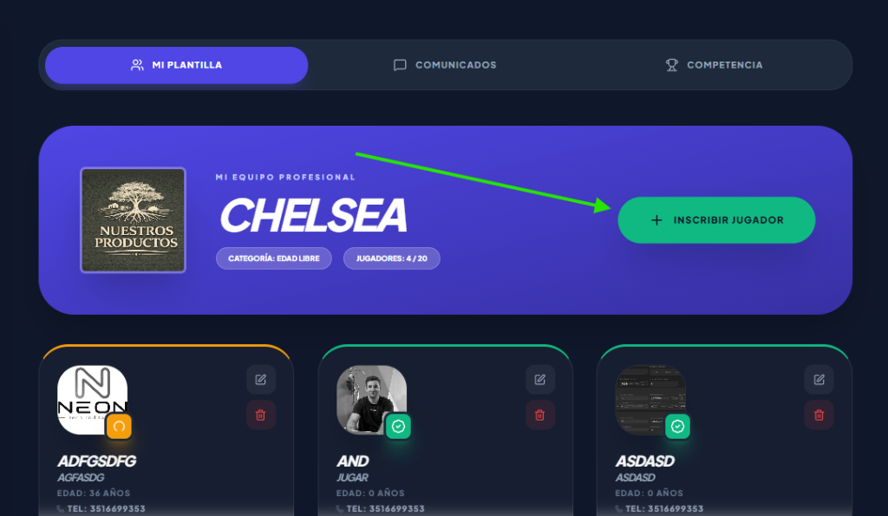

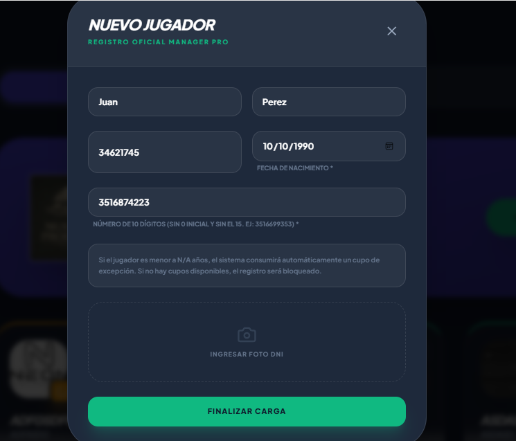

* **Nombre y Apellido:** Nombre completo según documento oficial.
* **DNI / Cédula de Identidad:** Número de documento único (el sistema valida duplicados).
* **Fecha de Nacimiento:** Día, mes y año de nacimiento.
* **Teléfono de Contacto:** Celular para contacto de emergencia.
* **Foto del DNI / Carnet:** Carga obligatoria del anverso del documento para verificación de identidad.

3. Presione **"GUARDAR JUGADOR"**.

#### 4.2.2. Reglas de Validación de Edad y Cupo de Excepciones
El sistema incorpora validación automática de reglas de competencia:
* Si el torneo establece categoría `+35`, cualquier jugador menor a 35 años disparará una alerta.
* Si el equipo ha agotado su cupo de excepciones o su cupo máximo de fichas, el sistema bloqueará el alta con un mensaje explicativo.

#### 4.2.3. Modificación de Datos de Jugadores
Para editar la información de un jugador existente (corregir DNI, actualizar foto o teléfono):
* Ubique al jugador en la grilla del plantel.
* Presione el botón con ícono de **Lápiz / Editar**.
* Realice los cambios necesarios y presione **"ACTUALIZAR"**.

#### 4.2.4. Baja / Eliminación de Jugadores
Si un jugador es desafectado del equipo antes del cierre de listas:
* Haga clic en el botón con ícono de **Cesto de Basura / Eliminar** en la fila del jugador.
* Confirme la acción en el diálogo de seguridad. La ficha quedará liberada para un nuevo alta.

#### 4.2.5. Seguimiento del Estado de Aprobación

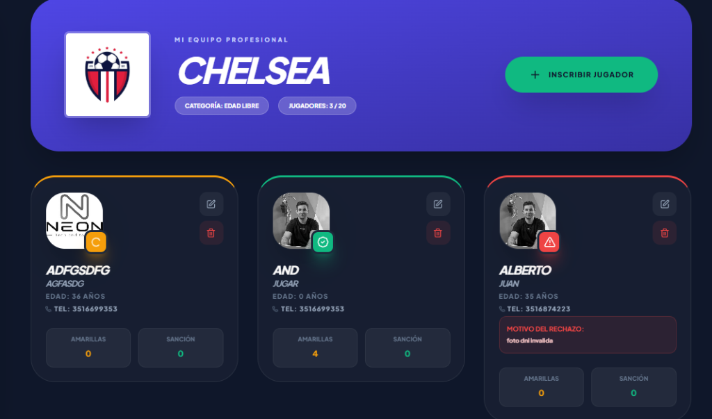

Cada jugador exhibe un badge de estado:
* `PENDIENTE (Amarillo)`: Ficha enviada, a la espera de validación de DNI por el Administrador.
* `APROBADO (Verde)`: Jugador habilitado oficialmente para disputar encuentros.
* `RECHAZADO (Rojo)`: Ficha observada (ej. foto de DNI ilegible o fecha incorrecta). Al posar el cursor o abrir la ficha se muestra el motivo exacto del rechazo para su corrección.

---

### 4.3. Consulta de la Competencia y Seguimiento Deportivo
En la pestaña **"Competencia"** del menú principal, el delegado accede a toda la información deportiva del torneo en el que participa:

#### 4.3.1. Fixture y Calendario de Partidos


* **Próximos Partidos:** Muestra el rival, fecha exacta, horario de inicio y cancha asignada.
* **Resultados Anteriores:** Marcadores finales registrados por el árbitro en fechas concluidas.
* **Descarga e Impresión:** Botón para exportar el fixture completo en formato PDF o imprimirlo.

#### 4.3.2. Tabla de Posiciones y Estadísticas

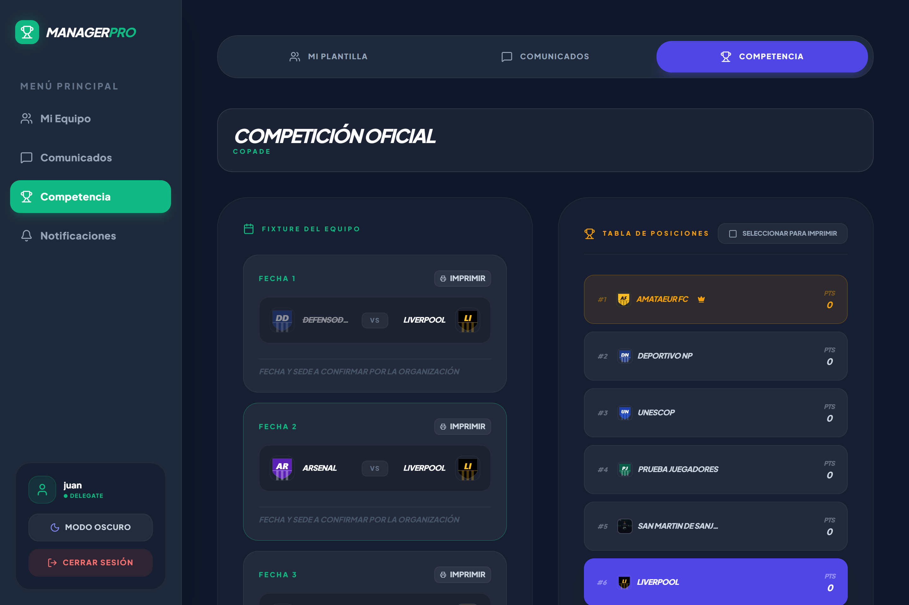

* **Columnas de la Tabla:** Partidos Jugados (PJ), Ganados (PG), Empatados (PE), Perdidos (PP), Goles a Favor (GF), Goles en Contra (GC), Diferencia de Gol (DG) y Puntos Totales (PTS).
* **Indicador de Forma / Racha:** Últimos 5 partidos con badges verdes (G), amarillos (E) y rojos (P).
* **Zonas de Clasificación:** Colores diferenciados para puestos de clasificación a Playoffs, Copas de Oro/Plata o descenso.

#### 4.3.3. Goleadores, Amonestados y Sancionados
* **Tabla de Goleadores:** Ranking actualizado con foto, nombre, equipo y cantidad de tantos convertidos.
* **Sanciones y Suspensión:** Lista de jugadores que acumulan tarjetas amarillas o que se encuentran suspendidos por expulsión, indicando las fechas restantes por cumplir.

---

### 4.4. Bandeja de Comunicados Oficiales
En la pestaña **"Comunicados"**, el delegado puede leer las notas oficiales enviadas por la liga, confirmar su lectura y descargar anexos reglamentarios.

---

## 5. MÓDULO DEL ÁRBITRO

El **Árbitro** es el encargado de certificar los acontecimientos deportivos y asentar el acta oficial digital del encuentro.

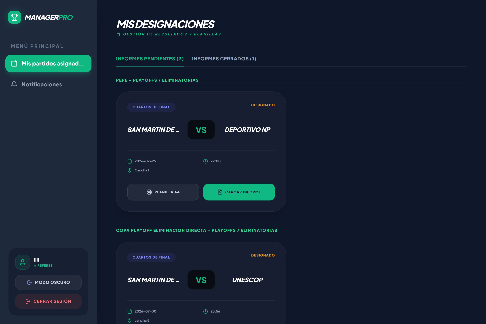

---

### 5.1. Consulta de Partidos Asignados
Al iniciar sesión, el colegiado visualiza su panel **"Mis Partidos Asignados"**:

* **Lista de Partidos Asignados:** Lista de partidos en los que fue designado por el Administrador.

* **Detalle por Tarjeta:** Cada tarjeta indica: Nombre de los equipos, fecha, horario programado, cancha asignada y estado del encuentro (`PENDIENTE` o `FINALIZADO`).

* **Pestañas de Filtrado:** Pestañas superiores para filtrar entre **Partidos Pendientes** y **Partidos Completados**.

---

### 5.2. Confección y Carga del Informe Arbitral Digital (Acta de Partido)
Al finalizar el encuentro en el campo de juego, el árbitro abre el partido presionando el botón **"CARGAR INFORME"** o **"COMPLETAR INFORME"**.

Se desplegará el modal interactivo del acta digital con tres secciones principales:

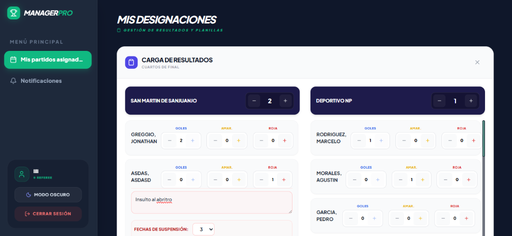

#### 5.2.1. Carga de Goles (Locales, Visitantes y Autogoles)

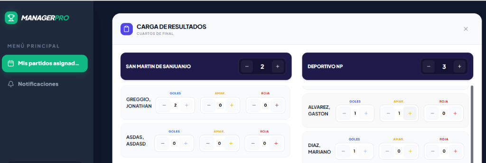

1. En la sección superior, use los botones **`+`** y **`-`** para establecer el tanteador del **Equipo Local** y del **Equipo Visitante**.
2. Por cada gol registrado, el sistema permite asignar el autor del tanto seleccionándolo de la lista de jugadores aprobados del equipo.
3. Si el tanto fue producto de un gol en propia puerta, marque la casilla **"Gol en Contra (Autogol)"**.
4. El marcador global se recalcula y sincroniza automáticamente.

#### 5.2.2. Registro de Sanciones Disciplinarias (Amarillas y Rojas con Motivo)

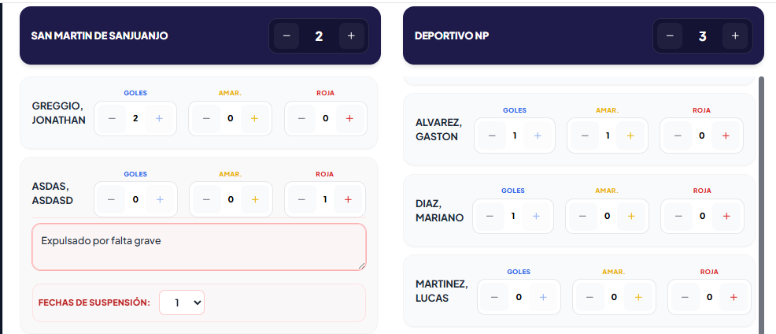

1. Desplácese a la sección **"Sanciones Disciplinarias"**.
2. Para registrar una amonestación:
   * Presione **"+ Agregar Tarjeta Amarilla"**.
   * Seleccione el equipo y el jugador amonestado.
3. Para registrar una expulsión:
   * Presione **"+ Agregar Tarjeta Roja"**.
   * Seleccione el equipo y el jugador expulsado.
   * **Motivo de Expulsión (Obligatorio):** Ingrese la causal reglamentaria (ej. *Doble amonestación*, *Juego brusco grave*, *Conducta violenta*, *Insultos al árbitro*).

> [!IMPORTANT]
> El motivo de la tarjeta roja es mandatorio para que el Tribunal de Disciplina y el Administrador puedan tipificar la sanción y computar las fechas de suspensión correspondientes.

#### 5.2.3. Observaciones del Encuentro e Informe de Incidentes

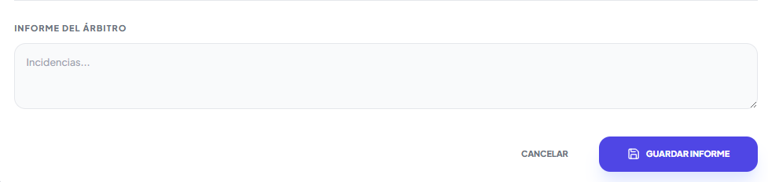

* En el campo de texto **"Observaciones del Árbitro"**, asiente detalles relevantes: puntualidad en el inicio, condiciones del terreno, comportamiento de las hinchadas, lesiones atendidas o cualquier eventualidad reglamentaria.

---

### 5.3. Cierre del Acta y Cómputo del Resultado Final
1. Revise que los goles, autores y tarjetas coincidan exactamente con la planilla física de campo.<br><br>
2. Presione el botón verde **"FINALIZAR Y GUARDAR INFORME"**.<br><br>
3. El sistema ejecutará automáticamente las siguientes acciones en cadena:<br><br>
   * Cambiará el estado del partido a `COMPLETADO`.<br><br>
   * Actualizará la tabla de posiciones (puntos, goles a favor, goles en contra y diferencia).<br><br>
   * Sumará los tantos a la tabla de goleadores.<br><br>
   * Acumulará las tarjetas en el legajo de los jugadores e inhabilitará automáticamente a quienes alcancen el límite de amonestaciones o hayan recibido tarjeta roja directa.<br><br>
   * En torneos de eliminación directa o playoffs, clasificará automáticamente al ganador a la siguiente ronda.

---

## 6. PREGUNTAS FRECUENTES (FAQ)

### ¿Cómo recupero mi contraseña si la he olvidado?
Comuníquese con el Administrador de la liga. Desde el módulo de Personal o Equipos, el Administrador puede restablecer su clave de acceso y asignarle una nueva clave provisoria.

### ¿Un jugador puede jugar en dos equipos del mismo torneo?
No. El sistema valida el número de DNI a nivel de base de datos. Si se intenta inscribir a un jugador cuyo DNI ya pertenece a otro equipo del mismo torneo, el sistema arrojará un error de duplicidad.

### ¿Qué sucede si un partido de eliminación directa termina en empate?
En los torneos de formato Eliminación Directa o Playoffs, el modal del informe arbitral habilitará automáticamente una sección especial para definir al ganador mediante **Tanda de Penales** o **Criterio de Desempate Reglamentario**, permitiendo avanzar de fase al equipo vencedor.

### ¿Se pueden editar los datos de un informe arbitral luego de guardado?
El árbitro puede reabrir el informe mientras la fecha esté abierta. Si la fecha ya fue cerrada administrativamente, solo el Administrador general posee privilegios para corregir errores materiales en el acta.

---

## 7. RESOLUCIÓN DE ERRORES COMUNES Y TROUBLESHOOTING

| Síntoma / Mensaje de Error | Causa Probable | Solución Paso a Paso |
| :--- | :--- | :--- |
| **"Acceso Denegado - Motivo: ..."** | El usuario ha sido suspendido temporalmente por la administración. | Contacte a la administración del torneo para regularizar su situación administrativa o disciplinaria. |
| **"El torneo debe tener al menos 4 equipos"** | Intento de generar fixture con menos de 4 equipos asignados. | Ingrese a la pestaña *Equipos* del torneo y asigne la cantidad reglamentaria de participantes antes de generar el fixture. |
| **"Límite de edad excedido / Sin cupos de excepción"** | El jugador es menor a la categoría requerida y se agotó el cupo de excepciones. | Verifique la fecha de nacimiento en el DNI. Si no corresponde excepción, deberá inscribir a un jugador que cumpla el rango de edad. |
| **"Cupo máximo de jugadores alcanzado"** | La lista de buena fe del equipo ha completado el número máximo de fichas fijado en las bases. | Dé de baja a un jugador inactivo o solicite al Administrador una ampliación excepcional del límite del torneo. |
| **"La foto no se visualiza o da error de carga"** | El archivo supera el tamaño máximo o formato no soportado. | Utilice imágenes en formato JPG o PNG con un peso inferior a 5 MB. |

---

## 8. BUENAS PRÁCTICAS Y RECOMENDACIONES OPERATIVAS

1. **Para Administradores:**
   * Cree los equipos y asigne sus delegados antes de generar el fixture para garantizar que las llaves queden completas y sin huecos.
   * Revise diariamente las fichas de jugadores pendientes de aprobación para no demorar la habilitación de los planteles antes del fin de semana.
2. **Para Delegados:**
   * Cargue las fotos del DNI con buena iluminación y legibilidad en los cuatro vértices del documento.
   * Verifique periódicamente la sección de sanciones para evitar alinear a jugadores inhabilitados por acumulación de tarjetas.
3. **Para Árbitros:**
   * Complete y envíe el informe arbitral digital inmediatamente al término del cotejo para mantener las tablas actualizadas en tiempo real para el público y los equipos.
   * Sea preciso y descriptivo en los motivos de las tarjetas rojas para facilitar la tarea del Tribunal de Disciplina.

---

## 9. GLOSARIO DE TÉRMINOS

* **Fixture:** Calendario integral de partidos y cruces programados a lo largo de un campeonato.
* **Lista de Buena Fe:** Nómina oficial de futbolistas registrados y habilitados por un equipo para competir.
* **Excepción de Edad:** Permiso reglamentario que habilita a un número acotado de jugadores fuera del rango etario estándar de la categoría.
* **Acta Digital:** Documento electrónico oficial donde se asientan los goles, amonestaciones, expulsiones y resultado definitivo de un partido.
* **Sistema Todos contra Todos:** Modalidad de competencia donde cada participante se enfrenta a todos los demás rivales de su categoría o zona sumando puntos.
* **Diferencia de Gol (DG):** Resultado algebraico de restar los goles en contra (GC) a los goles a favor (GF), utilizado como principal criterio de desempate en tablas de posiciones.

---

*Manual elaborado y certificado por el Equipo de Desarrollo e Ingeniería de Software de MANAGERPRO.*  
*Todos los derechos reservados © 2026.*
